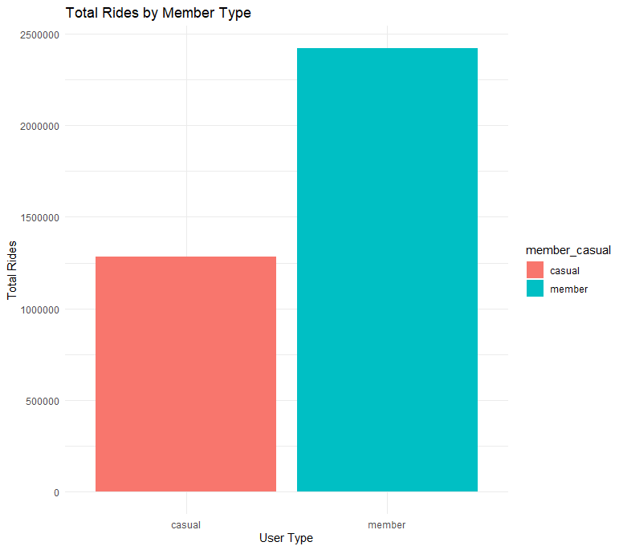
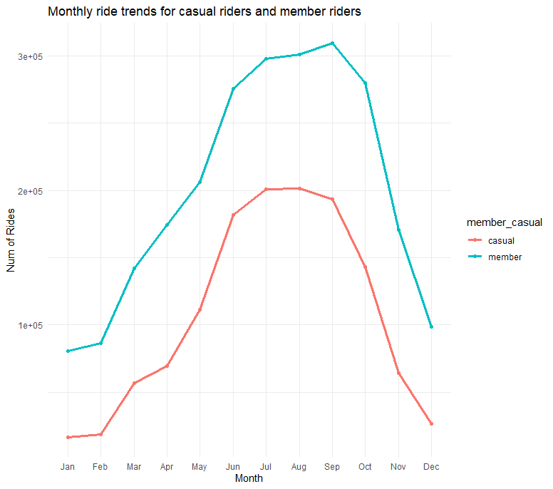
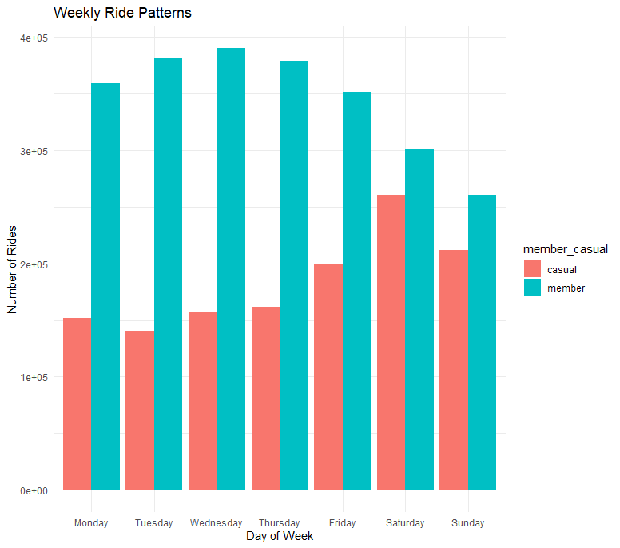
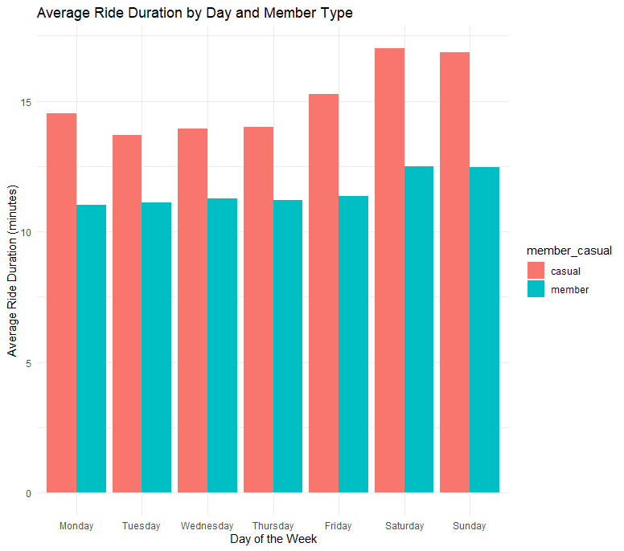
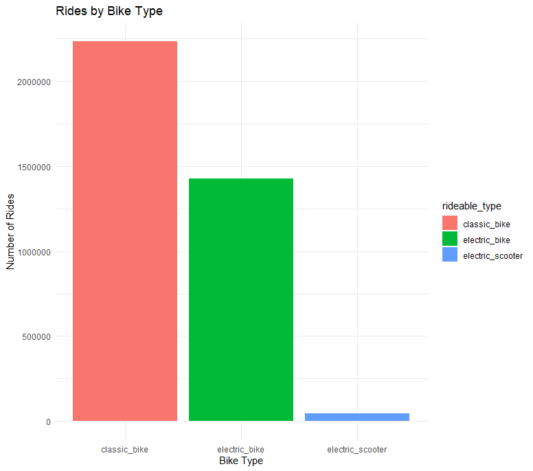
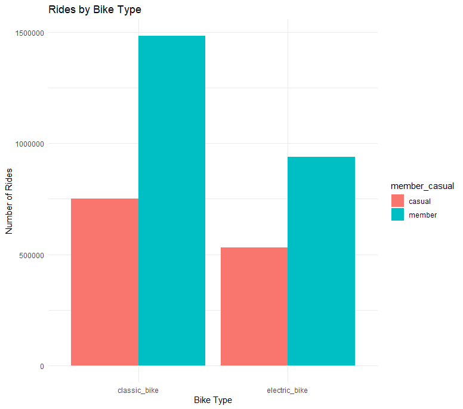
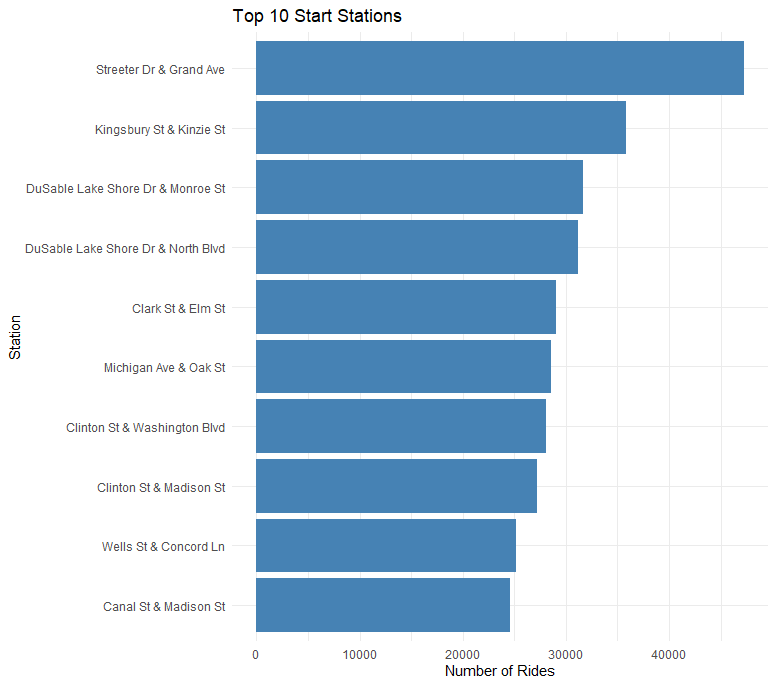
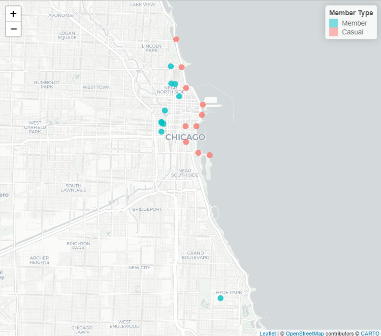

------------------------------------------------------------------------

# Scenario

Cyclistic is a bike-share company in Chicago. Since 2016, it has operated a growing fleet of 5,800+ bikes across 692 stations. The company offers flexible pricing plans: single-ride, full-day passes, and annual memberships.

Customers fall into two categories:

-   **Casual Riders**: Purchase single or daily passes

-   **Annual Members**: Subscribe for long-term use

The company has found that annual members are significantly more profitable. Instead of focusing solely on acquiring new customers, the marketing team wants to **convert casual riders into annual members**. To support this, the data analytics team has been asked to identify usage differences between the two rider types.<br>

------------------------------------------------------------------------

# Business Task

> **Goal**: Identify how casual riders and annual members use Cyclistic bikes differently, in order to inform targeted marketing strategies aimed at converting casual riders into members.

------------------------------------------------------------------------

# About Data

The dataset is based on real-world data provided by Motivate International Inc., and made available under an open [license](https://divvybikes.com/data-license-agreement). For this case study, it offers a reliable foundation to explore usage trends and differences between casual riders and annual members. The data is from 06-2024 to 05-2025.<br>

The data we have follows **ROCCC**:

1.   **Reliable** – Data is collected directly from Divvy’s automated bike tracking system, ensuring accuracy and consistency.

2.   **Original** – It is first-party data sourced directly from the official bike-sharing company.

3.   **Comprehensive** – Covers a full year of rides with detailed trip, time, location, and rider type information.

4.   **Current** – Updated monthly, with the latest data extending to June 2025.

5.   **Cited** – Officially provided by Divvy (Lyft Bikes and Scooters) through their public data portal.

<br>

# Data Cleaning

This section outlines the steps taken to clean and prepare the dataset for analysis.<br>

### Libraries Used

```{r setup, echo=TRUE}
library("tidyverse")
library("lubridate")
library("ggplot2")
library("dplyr")
library("stringr")
```

<br>

### Load the dataset

```{r, message=FALSE, warning=FALSE, error=FALSE}
dataset <- read.csv("C:\\Users\\saran\\Desktop\\data analysis projects\\case study\\Cyclistic\\Raw data\\202406-divvy-tripdata.csv")
nrow(dataset)
```

<br>

### Check for duplicates

```{r, message=FALSE, warning=FALSE, error=FALSE}

duplicates <- dataset[duplicated(dataset),]
duplicates

```

<br>

### Checking for unique values in relevant columns to identify any inconsistencies in naming conventions.

```{r, message=FALSE, warning=FALSE, error=FALSE}

n_distinct(dataset$rideable_type)
unique(dataset$rideable_type)

n_distinct(dataset$member_casual)
unique(dataset$member_casual)

```

<br>

### Trim Whitespace

Trim any leading or trailing whitespace from character columns.

```{r, message=FALSE, warning=FALSE, error=FALSE}

dataset <- dataset %>%
  mutate(across(where(is.character), str_trim))

```

<br>

### Remove Missing or Null Values

We filter out rows with missing or empty values in important fields like station names and IDs.

```{r, message=FALSE, warning=FALSE, error=FALSE}

dataset <- dataset %>%
  filter(
    !(start_station_name == "" | is.na(start_station_name)),
    !(start_station_id == "" | is.na(start_station_id)),
    !(end_station_name == "" | is.na(end_station_name)),
    !(end_station_id == "" | is.na(end_station_id))
  ) %>%
  mutate(
    start_lat = round(as.numeric(start_lat), 6),
    start_lng = round(as.numeric(start_lng), 6),
    end_lat = round(as.numeric(end_lat), 6),
    end_lng = round(as.numeric(end_lng), 6)
  )


```

<br>

### Clean Station IDs

We convert station IDs to characters, remove any decimals, and pad them with leading zeros for consistent length

```{r, message=FALSE, warning=FALSE, error=FALSE}

dataset <- dataset %>%
  mutate(
    start_station_id = as.character(start_station_id),
    end_station_id = as.character(end_station_id),
    
    start_station_id = gsub("\\.0$", "", start_station_id),
    end_station_id = gsub("\\.0$", "", end_station_id),
    
    start_station_id = str_pad(start_station_id, width = 12, side = "left", pad = "0"),
    end_station_id = str_pad(end_station_id, width = 12, side = "left", pad = "0")
  )


```

<br>

### Separate Date-Time Columns and Calculate Ride Duration

We convert the started_at and ended_at columns to proper date-time formats, calculate ride durations in seconds, and convert it to a more readable format.

```{r, message=FALSE, warning=FALSE, error=FALSE}

dataset <- dataset %>%
  mutate(
    started_at = ymd_hms(started_at),
    ended_at = ymd_hms(ended_at),
    
    start_date = as.Date(started_at),
    end_date = as.Date(ended_at),
    
    start_hour = hour(started_at),
    end_hour = hour(ended_at),
    
    ride_duration_secs = as.numeric(difftime(ended_at, started_at, units = "secs"))
  ) %>%
  filter(ride_duration_secs > 0) %>%
  mutate(
    ride_duration = sprintf(
      "%02d:%02d:%02d",
      as.integer(ride_duration_secs) %/% 3600,
      (as.integer(ride_duration_secs) %% 3600) %/% 60,
      as.integer(ride_duration_secs) %% 60
    )
  ) %>%
  select(-ride_duration_secs, -started_at, -ended_at)


```

<br>

### Save the Cleaned Data

After the cleaning process, we save the cleaned dataset to a CSV file for further analysis.

```{r, message=FALSE, warning=FALSE, error=FALSE, eval = FALSE}

write_csv(dataset, "data_cleaned/2025_06_cleaned.csv")

```

<br>

### Combine Quarterly Data

We combine the cleaned data from multiple months to form quarterly datasets. This is useful for creating time-based analysis and comparisons.

```{r, message=FALSE, warning=FALSE, error=FALSE, eval = FALSE}


q1_files <- c("data_cleaned/2024_06_cleaned.csv",
              "data_cleaned/2024_07_cleaned.csv",
              "data_cleaned/2024_08_cleaned.csv")

q2_files <- c("data_cleaned/2024_09_cleaned.csv",
              "data_cleaned/2024_10_cleaned.csv",
              "data_cleaned/2024_11_cleaned.csv")

q3_files <- c("data_cleaned/2024_12_cleaned.csv",
              "data_cleaned/2025_01_cleaned.csv",
              "data_cleaned/2025_02_cleaned.csv")

q4_files <- c("data_cleaned/2025_03_cleaned.csv",
              "data_cleaned/2025_04_cleaned.csv",
              "data_cleaned/2025_05_cleaned.csv")


combine_quarter <- function(file_list) {
  file_list %>%
    map_dfr(read_csv)
}


q1 <- combine_quarter(q1_files)
q2 <- combine_quarter(q2_files)
q3 <- combine_quarter(q3_files)
q4 <- combine_quarter(q4_files)


write_csv(q1, "data_quarters/Q1_2024_cleaned.csv")
write_csv(q2, "data_quarters/Q2_2024_cleaned.csv")
write_csv(q3, "data_quarters/Q3_2024_2025_cleaned.csv")
write_csv(q4, "data_quarters/Q4_2025_cleaned.csv")


```

<br>

# Initial Exploratory Data Analysis

## Loading the dataset

```{r}

q1 <- read.csv("C:/Users/saran/Desktop/data analysis projects/case study/Cyclistic/data_quarters/Q1_2024_cleaned.csv")

q1_cleaned <- q1 %>%
  filter(ride_duration != "00:00:00")

q1_cleaned <- q1_cleaned[!(q1_cleaned$ride_duration > "00:50:00" | q1_cleaned$ride_duration < "00:02:00"), ]

q1_cleaned$day_of_week <- weekdays(as.Date(q1_cleaned$start_date))

q1_cleaned$day_of_week <- factor(
  q1_cleaned$day_of_week,
  levels = c("Monday","Tuesday","Wednesday","Thursday","Friday","Saturday","Sunday")
)

```

Initial look at the quarter data showed, several outliers on both ends, some at 0s and others around 25 hours. Picking a reasonable range from 2 mins to 50 mins for our exploration. Also introduced columns for weekdays and months.

<br>

### Number of Rides per Member Type

We start by analyzing the number of rides based on member type (i.e., whether the rider is a "member" or a "casual" user). This gives us an overview of the distribution of rides across these two categories.

```{r, message=FALSE, warning=FALSE, error=FALSE}

q1_cleaned %>%
  count(member_casual)

```

<br>

### Number of Rides per Bike Type

Next, we explore the number of rides based on the type of bike used (rideable_type). This helps us understand the distribution of bike usage across different types.

```{r, message=FALSE, warning=FALSE, error=FALSE}

q1_cleaned %>%
  count(rideable_type)

```

Classic bikes can be seen to be more favored among the riders.

<br>

### Number of Rides per Bike Type by Member Type

We can further investigate how each member type uses the different types of bikes.

```{r, message=FALSE, warning=FALSE, error=FALSE}

q1_cleaned %>%
  count(rideable_type, member_casual)
        
```

<br>

### Ride Duration Analysis

We now analyze the ride duration for both members and casual users. To do this, we calculate the average and median ride duration in minutes for each group.

```{r, message=FALSE, warning=FALSE, error=FALSE}

q1_cleaned %>%
  mutate(ride_duration_secs = as.numeric(hms(ride_duration))) %>%
  group_by(member_casual) %>%
  summarise(
    avg_ride_duration = mean(ride_duration_secs, na.rm = TRUE) / 60,
    median_ride_duration = median(ride_duration_secs, na.rm = TRUE) / 60
  )

```

The difference between the average and median suggests there could a few outliers that are pulling the average towards them. The median gives a better picture regarding trip durations.

<br>

### Ride Distribution by Day of the Week

Next, we analyze the number of rides that occurred on each day of the we

```{r, message=FALSE, warning=FALSE, error=FALSE}

q1_cleaned %>%
  group_by(day_of_week) %>%
  summarise(rides = n())

```

<br>

### Ride Distribution by Day of the Week and Member Type

We also explore how the number of rides is distributed across different days of the week for each member type.

```{r, message=FALSE, warning=FALSE, error=FALSE}

q1_cleaned %>%
  group_by(day_of_week, member_casual) %>%
  summarise(rides = n()) %>%
  pivot_wider(names_from = member_casual, values_from = rides) %>%
  rename_with(~ paste0(.x, "_rides"), -day_of_week)

```

Number of rides increase around weekend for casual riders whereas for members it stays roughly the same across the week. But members trips remain far more than casual riders trips.

<br>

### Ride Distribution by Hour of the Day

Understanding the distribution of rides across different hours of the day can provide insights into peak usage times.

```{r, message=FALSE, warning=FALSE, error=FALSE}

q1_cleaned %>%
  group_by(start_hour) %>%
  summarise(rides = n()) %>%
  arrange(desc(rides))

```

The most common hours seem to be evening and early morning which are usually commute hours.

<br>

### Ride Distribution by Station Name

Next, we look at the ride distribution based on start station names, which helps in identifying the most popular stations.

```{r, message=FALSE, warning=FALSE, error=FALSE}

q1_cleaned %>%
  group_by(start_station_name) %>%
  summarise(rides = n()) %>%
  arrange(desc(rides))

```

<br>

### Ride Distribution for Members by Station

We also filter the data to analyze the distribution of rides based on stations specifically for members.

```{r, message=FALSE, warning=FALSE, error=FALSE}

q1_cleaned %>%
  filter(member_casual == 'member') %>%
  group_by(start_station_name) %>%
  summarise(rides = n()) %>%
  arrange(desc(rides))

```

<br>

### Ride Distribution for Casual Users by Station

Similarly, we analyze the ride distribution based on stations specifically for casual users.

```{r, message=FALSE, warning=FALSE, error=FALSE}

q1_cleaned %>%
  filter(member_casual == 'casual') %>%
  group_by(start_station_name) %>%
  summarise(rides = n()) %>%
  arrange(desc(rides))

```

A similar process was followed for the rest of the quarters as well. Now combining all of them into one we will start exploring a patterns over the year.

<br>

## Visual Analysis

### Number of Rides by the member type

The below graph shows that across the entire year members around 2.3 million total trips compared to around 1.27 million for casual riders. Which is around 81% more trips!



<br>

### Monthly trends



If we check the number of trips across the year, summer season seems to be favored by both casual and members alike. The usage of bikes increases starting May and is well above till the end of Fall.

<br>

### Day Trends



Observing the number of rides tells us that members make trips far more on weekdays, and for casual riders it increases on weekends. This is likely due to members using the bikes for daily commute to work. Whereas casual riders using them for recreation.

<br>

This notion is further strengthened by looking at the average ride lengths.



The duration remains almost same for members on all days whilst casual riders ride for longer periods.

<br>

### Bike Preferences



During this visualization I came across a third category of bike, the electric scooter. This was likely due to a typo, since this category was only present in one of the months and therefore, i had to clean it up. This showed that cleaning is an iterative process and during the visualizations many things can come forward which might have been missed in the first pass.

<br>



Classic bikes are clearly more preferred among riders. This might be due to the cost of it being less compared to their electric counterparts.

<br>

### Geo Spatial Analysis



Above plot shows the top 10 stations among riders. But dividing it further based on members and casual riders, introduces us to an interesting finding.

<br>



The top preferred stations for casual riders is along the coast line near tourist spots compared to members for whom top used stations are within city likely near residential and business areas.

<br>

## Key Observations

1.  Casual riders ride for longer durations compared to members, suggesting recreational use
2.  Members use bikes far more on weekdays, indicating they use it for commute.
3.  Popular stations differ as members start around residential and business localities whereas casual riders near tourist spots or parks.
4.  The bike usage increases drastically during summer months for both type of riders.

<br>

## Suggestions

To convert casual riders to members, below are some steps that can be taken:

1.  Creating weekend or seasonal membership plans targeting tourists and seasonal riders.
2.  For casual riders, riding more than 5+ times a month, send promotional emails showing cost savings between 5 casual rides vs 5 membership rides.
3.  Advertisements should be posted at popular spots encouraging riders to try memberships.

<br>

## Conclusion

The analysis and visualization of a year’s Cyclistic ride data revealed distinct patterns between casual and member riders. Members use the service primarily for commuting, while casual riders tend to engage in longer, recreational rides. By implementing targeted promotional campaigns, seasonal plans, and highlighting cost savings, Cyclistic can effectively convert casual riders into loyal members.

<br>

## What I Learned

-   Gained practical experience in cleaning, transforming, and analyzing real-world datasets using R.

-   Learned how to create new time-based variables (e.g., ride duration, start hours, days of the week) to better understand user behavior.

-   Improved my ability to perform exploratory data analysis (EDA) to extract actionable insights.

-   Enhanced skills in translating raw data into meaningful business strategies, such as creating targeted membership offers.

-   Strengthened my proficiency in using tidyverse, lubridate, and ggplot2 for data manipulation, summarization, and visualization.

<br>

------------------------------------------------------------------------

<br>

<br>
